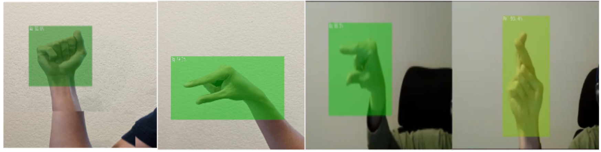

handsign-recognition 

This work was firstly done at UC Berkeley class, I improved it after the course finished. 
Instructors: Ryan DeJana, Prabhakar Attaluri

## Credit
A large portion of this repository uses the jetson-inference repository by NVIDIA -
https://github.com/dusty-nv/jetson-inference as reference. Several of the python
scripts were modified to adjust to our particular use case. 

## Introduction
This repository holds the code to run a mobilenet_v2 model that is trained to detect
American Sign Language. The model can be trained by navigating to the following
path and running the train_ssd.py script. Just make sure you have training data
setup under the folder structure with VOC xml. After training you can export the
pytorch model to an onnx model to run TensorRT.
```
/python/training/detection/ssd
```


## challenges while working on this project.

The RoboFlow dataset applied on YOLOv5 had high accuracy on the test dataset, which was
promising at first, but when I anecdotally tested on it the live video feed, it didn’t do
particularly Ill. I believe that the model could not deal with the background noise and spatial
variation in gestures that the test dataset did not measure.
The models I trained also seem to be overfit to our training data. Skin color, depth of the
gesture, background noise, choice of background, and spatial orientation of the gestures are all
important factors in determining how Ill the model does in accurately predicting the gesture
classification. The only solution for this is to increase the amount of training data and having
diverse data with many types of hands, backgrounds, depth and orientation. Accumulating and
annotating data is a tedious task, but it is a definite way to generalize the model rather than
using artificial methods to boost the accuracy.
I also faced a multitude of technical challenges on this project as Ill.
The Nvidia Jetson deep learning deployment platform scales Ill to perform on the Jetson, but
when training or inferring on non-Jetson devices such as EC2 cloud instances or local Ubuntu
machines with discrete graphics cards, I would face issues with running the inference
because of incompatibilities with code libraries. I specifically faced a variety of segmentation
fault issues that Ire sometimes extremely hard to debug to the point where I had to resort to
alternate ideas to get the code to run.
The platform did not work as expected with the annotations from Roboflow compared to the
much more efforted steps of the Nvidia capture tool. This decreased the dataset size just due to
potential time in setting up the dataset with proper annotations. I also had issues where the
deployed models on the Jetson would be trained as expected but there would be no reaction of
the Jetson for any inference or detection leading us to be confused if the model was at fault or
external issues regarding compatibility or otherwise.
Furthermore, when I tried to do validation and test results on an Amazon EC2 instance or
local machine with a discrete GPU (for speed) I faced compatibility issues with how the
platform was Jetson specific and not a CUDA anywhere platform that ran on CUDA hardware
but agnostic of the actual device. The code seemed to be dependent to run on a Jetson only
and was very difficult to migrate to a non-Jetson host machine for mainly library and
environment issues.


## Platform from Edge to Cloud


## The validation results were as follows:


## Sample Test Images 
The results from the test images between YOLO_v5 and MobileNet_v2 were extremely similar.
However, the MobileNet_v2 model was more robust. Different backgrounds and depth of the
images were less flaky compared to the YOLO_v5 model. This makes sense because
MobileNet has rich feature representations, but lacks speed. As such, the model is much more
confident in its classifications, this was something we deemed as important due to the accuracy
needed for language translations. MIscommunication would be a very bad thing to allow
through.




## Evaluation Metrics
The model is evaluated in two ways: 1) anecdotal testing of the model via a webcam and looking
at the results based on given gestures and 2) feeding in test images to the model and having it
classify them.
Anecdotal evidence is straightforward. It is manual testing of each image by each person in
various gestures.
The test image classification is measured by the loss over epochs, which we used tensorboard
to display (shown below).


 

## Prerequisites
Before attempting to run the application end to end please be aware of the
following.

1. Configure an AWS Cloud Instance.
2. Configure a public AWS S3 Bucket.
3. Make sure you have permissions to put objects into the S3 Bucket.
4. Keep your AWS Access Key and AWS Secret Access Key handy. You will need to
pass them in the imageprocessor.py file to store images onto the S3 Bucket.
5. You will need k3s (Kubernetes) on both the Jetson Nano and the AWS Cloud
Instance.
6. Have a Jetson Device handy.

## Starting the Model Detection on the Jetson
To get a model trained and running run the following commands:
```
python3 train_ssd.py --dataset-type=voc --data=data/<name> --model-dir=models/<name> --batch-size=# --workers=# --epochs=#

python3 onnx_export.py --model-dir=models/<name>

detectnet --model=models/<name>/ssd-mobilenet.onnx --labels=models/W251/labels.txt --input-blob=input_0 --output-cvg=scores --output-bbox=boxes /dev/video0
```

If you do not want to run on a live video feed, replace /dev/video0 with a
folder path that contains a set of images to run tests on.

## How to Run the Application w/ MQTT
Make sure you have Kubernetes up and running on both the Jetson Nano and Cloud
Instance.

We will be building Docker containers and initializing them in Kubernetes. The
files are neatly bundled under their respective folders - Jetson or Cloud_AWS.

Note: The commands below are referencing my Docker Hub Account, you can build,
tag, and push to your own account. Just change the yaml files accordingly.

Note: In order for the application to run be sure you pass in your AWS Keys in
detectMQTT.py

Note: The exposed ports used in the files need to be updated to your instances ports.

Run the following:
```
python3 detectMQTT.py
```
This will launch the detection model and for every detection we will send information to the cloud (s3 bucket). 

### Jetson
1. Launch the Local MQTT Broker (Jetson/Jetson_Broker)
```
docker build --no-cache -t johnymah/mosquitto:v1 .
docker push johnymah/mosquitto:v1
kubectl apply -f mosquitto.yaml
kubectl apply -f mosquittoService.yaml
```

2. Launch the Face Detector (Jetson/Face_Detector)
```
docker build --no-cache -t johnymah/facedetector:v1 .
docker push johnymah/facedetector:v1
kubectl apply -f facedetector.yaml
```

3. Launch the MQTT Message Forwarder (Jetson/Forwarder)
```
docker build --no-cache -t johnymah/forwarder:v1 .
docker push johnymah/forwarder:v1
kubectl apply -f forwarder.yaml
```

### Cloud
1. Launch the Cloud MQTT Broker
```
docker build --no-cache -t johnymah/mosquitto:v1 .
docker push johnymah/mosquitto:v1
kubectl apply -f mosquitto.yaml
kubectl apply -f mosquittoService.yaml
```

2. Launch the Image Processor
```
docker build --no-cache -t johnymah/imageprocessor:v1 .
docker push johnymah/imageprocessor:v1
kubectl apply -f imageprocessor.yaml
```

### Shutdown
1. To Shutdown (Jetson)
```
kubectl delete deploy moquitto-forwarder-deployment
kubectl delete deploy facedetector
kubectl delete deploy mosquitto-deployment
kubectl delete service mosquitto-service
```
2. To Shutdown (Cloud)
```
kubectl delete deploy mosquitto-deployment
kubectl delete deploy image-processor
kubectl delete service mosquitto-service
```

### Useful Commands for Debugging / See Logs
1. To See Services or Deployments
```
kubectl get services
kubectl get deployments
```
2. To See Logs of Pods
```
kubectl get pods -l app=<insert app name>
kubectl get logs -f <pod name>
```
